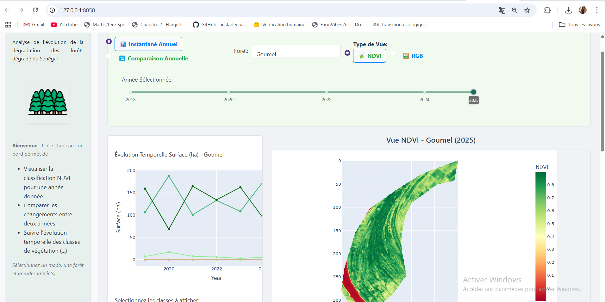

# Dashboard de Suivi de la Déforestation au Sénégal
 **Lien de l'application :** https://geoforestguardian-e50a48e16183.herokuapp.com/
 Veillez utuliser ce lien avec modération,les données sont dans AWS et chaque requete est facturé.
 Noter que parfois les serveurs de Heroku bloquent l'affichage des images, donc seul les captures d'écrans font office de rendue finale.

 ## Introduction

Notre projet vise à fournir un tableau de bord interactif et dynamique pour l'analyse et le suivi de l'évolution de la couverture végétale et de la déforestation au sein des forêts classées du Sénégal. Cet outil permet d'explorer visuellement les changements temporels et spatiaux en utilisant des données raster GeoTIFF.

## Origine et Développement

Pour accélérer notre développement, nous nous sommes initialement appuyés sur un exemple pertinent issu de la galerie d'applications Dash ([https://dash-gallery.plotly.host/Portal/](https://dash-gallery.plotly.host/Portal/)). Nous avons analysé et déconstruit cet exemple afin d'en comprendre la structure et la logique sous-jacente.

Ce processus nous a conduits à organiser notre projet de manière modulaire :

* **`app.py` :** Point d'entrée principal, définissant le layout global avec Dash Bootstrap Components et initialisant l'application.
* **`components/` :** Répertoire contenant les modules pour les éléments visuels réutilisables (sidebar, sélecteurs, graphiques, etc.).
* **`callbacks/` :** Module(s) gérant l'interactivité et la logique de mise à jour de l'application.
* `utils/` :** Modules pour l'accès aux données sur AWS S3, les calculs raster (NDVI, classification, statistiques) et la gestion des constantes.

Dans le dossier `notebooks`, nous avons également mené des explorations préliminaires, notamment sur l'utilisation de l'API Sentinel Hub et des capacités graphiques de Plotly.

Cette structure modulaire nous a permis d'adapter et d'enrichir l'application pour répondre à nos besoins spécifiques, en nous concentrant sur l'analyse des données GeoTIFF des forêts sénégalaises.

## Architecture et Fonctionnement

L'application offre une interface utilisateur organisée permettant une exploration intuitive :

1.  **Sélection des Paramètres :** L'utilisateur choisit le **Mode d'Analyse** (Instantané Annuel ou Comparaison Annuelle), la **Forêt** d'intérêt, l'**Année** principale via un slider temporel, et le **Type de Vue** (NDVI ou RGB). Pour le mode Comparaison, une seconde année peut être sélectionnée via un menu déroulant.
2.  **Visualisation Raster (`px.imshow`) :** La zone principale affiche une image représentant les données du fichier TIF source correspondant aux sélections (Forêt, Année, Vue). Nous utilisons `plotly.express.imshow` pour cet affichage direct des données raster.
3.  **Statistiques et Distribution :** Pour la vue NDVI, les statistiques de couverture par classe (calculées à la volée via `calcul_ndvi`, `classify_ndvi`, `calcul_class_stats`) sont présentées sous forme d'un graphique à barres et d'un tableau détaillé (Surface en ha, % Couverture).
4.  **Analyse Temporelle :** Un graphique linéaire interactif illustre l'évolution de la surface des différentes classes de végétation (issues des statistiques NDVI) au fil des années pour la forêt sélectionnée. Un filtre permet de se concentrer sur des classes spécifiques.
5.  **Analyse Comparative :** En mode Comparaison, l'application calcule et affiche les différences de surface nettes pour chaque classe de végétation entre les deux années choisies, mettant en évidence les gains et les pertes.
6.  **Indicateurs Additionnels :** La zone tertiaire fournit la légende des classes NDVI et, en mode Instantané, une indication de la tendance générale d'évolution pour les classes principales (calculée via `calculate_trend`).

## Données et Accès AWS

Les données  de ce tableau de bord sont les images satellite au format GeoTIFF. Initialement stockées et traitées localement, nous avons migré l'accès aux données vers le cloud pour plus de flexibilité et de scalabilité.

Nos fichiers TIF sources sont hébergés sur **Amazon S3**, dans le bucket `hackaton-stat` (sous le préfixe `Data_hackathon_stat_data_raster/`). Le module `aws_data_loader.py` utilise la bibliothèque `boto3` et les credentials AWS (configurés via variables d'environnement) pour lister et lire ces fichiers directement depuis S3. Les calculs (NDVI, statistiques) sont ensuite effectués à la volée par l'application Dash lors des interactions utilisateur.

## Interactivité via Callbacks

Le dynamisme et l'interactivité de l'application reposent intégralement sur le système de **Callbacks Dash**. La fonction principale `update_dashboard` (dans `callbacks/main_callback.py`) est déclenchée par les changements des sélections utilisateur (`Input`). Elle orchestre la lecture des données depuis S3, les calculs, la génération des figures Plotly et la mise à jour de tous les composants d'affichage (`Output`). La gestion de ces callbacks, bien que puissante, demande une attention particulière aux dépendances et aux types de données retournés pour assurer la stabilité de l'application. Nous avons configuré le callback principal pour s'exécuter dès le chargement initial (`prevent_initial_call=False`) afin d'afficher directement les données de l'année la plus récente.

## Considérations Futures

Au cours du développement, nous avions envisagé d'utiliser le format **GeoJSON** pour certaines visualisations. Cela aurait pu permettre une cartographie plus interactive (type Leaflet/Mapbox) et faciliter des analyses comme le suivi détaillé de l'évolution pixel par pixel. Cependant, compte tenu de la complexité associée et de notre objectif prioritaire d'afficher et d'analyser les données TIF sources, nous avons choisi de reporter cette exploration pour de futures versions potentielles de l'outil.

## Fonctionnalités Clés (Résumé)

* **Visualisation Spatiale :** Affichage direct des données raster TIF (NDVI ou RGB) via `px.imshow`.
* **Sélection Intuitive :** Choix facile de la forêt, de l'année (slider), du mode d'analyse et du type de vue.
* **Modes d'Analyse :** Vue détaillée d'une année ("Instantané") ou comparaison des statistiques entre deux années ("Comparaison").
* **Calculs à la Volée :** Calcul du NDVI et des statistiques de couverture directement depuis les TIF sources sur S3.
* **Suivi Temporel :** Graphique de l'évolution des surfaces par classe au fil du temps.
* **Indicateurs de Tendance :** Identification simple des tendances (hausse/baisse/stable) pour les classes clés.
* **Données Cloud :** Intégration transparente avec les données stockées sur AWS S3.

## Contribution

Les contributions sont les bienvenues ! Si vous souhaitez améliorer ce dashboard, veuillez créer une branche (`branch`) pour vos modifications et soumettre une pull request.

## Auteurs

* Hanna Amovi
* Konlambigue
* Moussa

---

## Aperçus de l'Application

